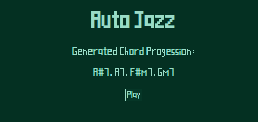

# autojazz
Generated Jazz Chord Progessions.

The algorithm goes through every possible chord within a couple octaves and scores each one based on these rules:

| Rule | Score |
| --------------------------------------- | ----- |
| Each Shared Note | +3 |
| Each Shared Note 1 semitone off | +2 |
| Each Shared Note 2 semitones off | +1 |
| Root is down a 5th from the prev. chord | +2 |
| Prev. is a V7 chord and new is m7 | +2 |

